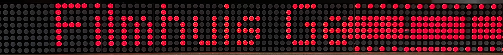
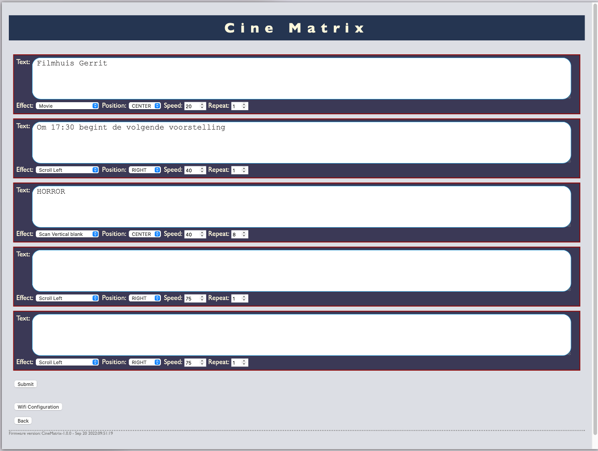
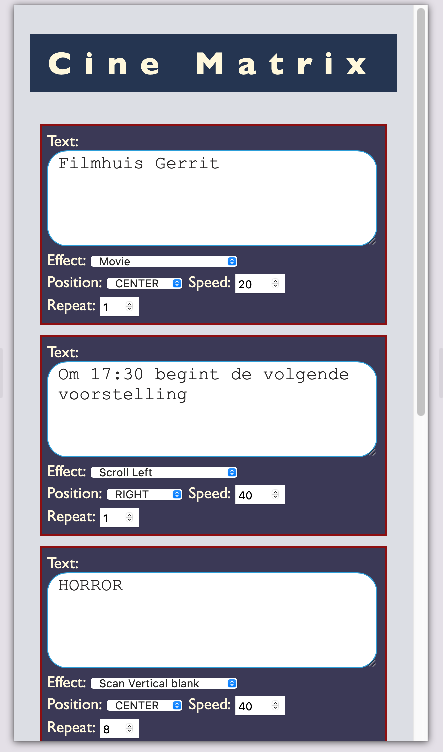

# Matrix Display Web Server

## What is it
A matrix display driver that is configurable through a web interface.

## How to use
Connect your ESP-32 Dev Kit C to your MAX72XX Matrix array: the following defaults: DATA_PIN 25, CS_PIN 26, CLK_PIN 27. Make sure tho select the 5V terminal on the ESP32 and connect ground to a ground terminal.

After powering up the ESP32 it will set up a wireless access point. The matrix display will show its name and password on first start up and print some instructions on how to connect your browser.

## Security

The security is based on the ability to connect to the access point and thus on wireless security protocols.

## Acknowledgements

This code was developed for [Filmtheater Gerrit](http://filmtheater-gerrit.nl) on Visual Studio Code for Mac OS X with PlatformIO. It relies heavily on [the Parola for Arduino Library](https://majicdesigns.github.io/MD_Parola/index.html) and borrows code fragment from [ESP32ressoMachine](https://kolkman.github.io/ESP32ressoMachine/), one of my other projects.

## Screenshots

